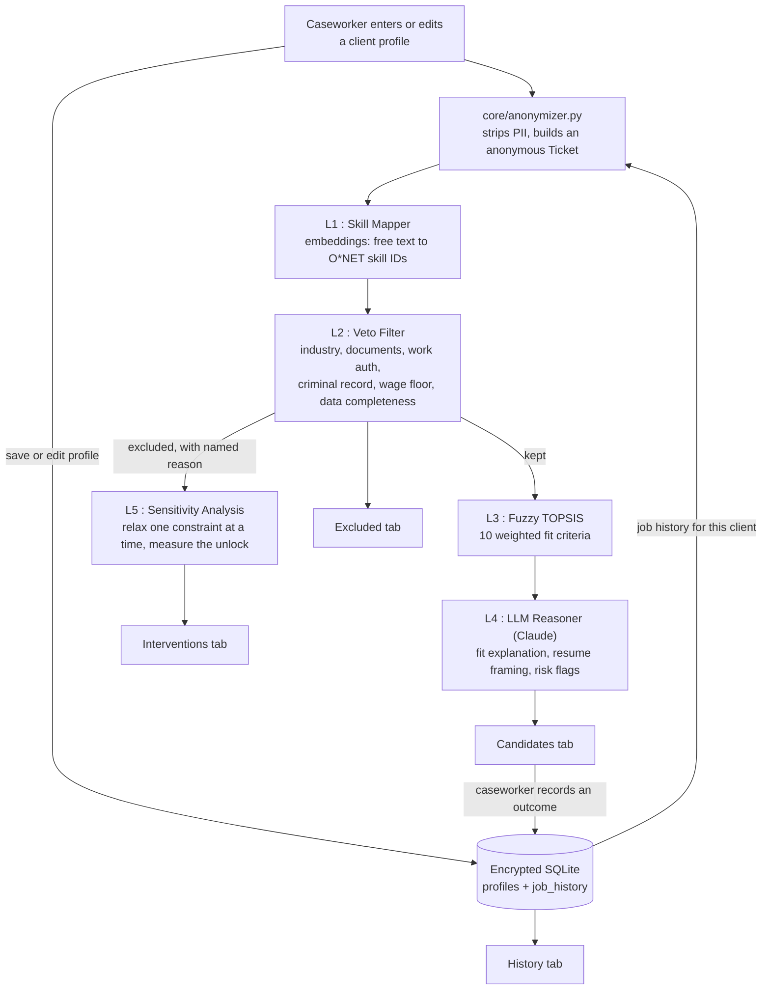

# Pathway Planner

A decision-support tool for caseworkers supporting trafficking clients. Matches clients to occupations while respecting safety, legal, and economic constraints. The caseworker decides; this tool surfaces options.

## Background

Trafficking clients face compounding barriers when seeking economic stability: trauma-shaped constraints around work environment and schedule, legal complications (criminal records often acquired during exploitation), missing documentation, and wage requirements that low-wage retail can't meet. Existing job-matching tools optimize for placement metrics, not client agency.

This tool inverts that. It treats the caseworker as the decision-maker, surfaces ranked options with explicit safety and economic tradeoffs, and shows what specific interventions like vacatur filings, DMV pathways, T-visa applications, would unlock more options.

Built for the USAII Global AI Hackathon 2026, "AI for Systems & Society" track, Brief 5 (Safe Passage / Survivor Care), Direction B.

## How it works

A caseworker enters a client's profile — skills as free text, constraints, what's off the table. Before anything else happens, that profile is stripped down to an anonymous record (the model never sees a name) and passed through five stages:

1. **Maps skills.** Free-text skill descriptions are embedded and matched against an O\*NET skill catalog by cosine similarity — "drywall installation and repair" resolves to canonical skill clusters like *Installation* and *Repairing*, not kept as an unstructured string.
2. **Filters.** Occupations that violate a hard constraint like excluded industry, missing documentation, work authorization, criminal-record requirement, wage floor, or insufficient reference data — are removed, each with the exact named rule that cut it. Nothing disappears silently.
3. **Scores** the surviving occupations on ten weighted criteria (skill match, wage fit, isolation, customer-facing intensity, schedule alignment, history with this occupation, and more) using a fuzzy MCDA approach with TOPSIS distance-to-ideal aggregation.
4. **Explains** the top candidates with Claude generating fit prose grounded in the actual scores, safe resume framings (respecting the caseworker's citability calls on each skill), and risk flags worth verifying before forwarding a posting.
5. **Analyzes** what was filtered out, in parallel with scoring: for every hard constraint, it re-runs the filter with just that one constraint lifted and counts what would *really* come back, separating actionable interventions (get a document, discuss a wage floor) from non-actionable safety exclusions (an industry the client asked to avoid).

The UI presents this across four tabs: **Candidates**, **Excluded**, **Interventions**, and **History** (what happened to candidates a caseworker has acted on before). The caseworker reads them and decides what to discuss with the client and what to act on.

## Architecture



A few things this diagram is making explicit:

- **PII never enters the pipeline.** `core/anonymizer.py` strips identity fields (legal name, phone, DOB) before a `Ticket` is built. Everything from L1 onward, including the LLM prompt operates on the anonymous payload only. Identity stays encrypted (AES-256-GCM) in SQLite, addressed only by an HMAC-derived ticket ID.
- **L3 and L5 run in parallel, on different inputs.** L3 scores what *survived* the veto filter; L5 analyzes what got *cut*. Neither needs the other's output, so they run concurrently rather than in sequence.
- **The History tab doesn't go through the pipeline at all.** It reads recorded outcomes (saved, applied, interviewing, offered, accepted, rejected, withdrawn) directly from SQLite. Those outcomes feed *back* into the next pipeline run as a soft scoring signal (a previously-declined occupation is mildly deprioritized, never hard-excluded) and the loop is closed, but a past outcome is treated as context, not a verdict.
- **Every excluded occupation carries a reason, including "insufficient data."** About 10% of the occupation reference data (concentrated in the highest-wage specialist and management titles) has no skills list or work-context ratings at all. Rather than let missing data default to a neutral-or-favorable score and quietly win on a technicality, those occupations are filtered out by name, same as any other hard constraint.

## Stack

- Python 3.12 with `uv` and `ruff`
- Streamlit and Plotly for the UI
- `sentence-transformers` (`BAAI/bge-small-en-v1.5`) for skill-to-O\*NET embedding matching — local, deterministic, no API cost
- Anthropic Claude (Sonnet 4.6, temperature 0, JSON-enforced output) for candidate explanations
- Pydantic v2 for contracts
- SQLite + `cryptography` for encrypted persistence (AES-256-GCM field-level encryption, HMAC-SHA-256 keyed identifiers)
- Docker for reproducible runs

## Running

### Prerequisites

- Docker
- An Anthropic API key

### Set up

Generate two 32-byte secrets for at-rest encryption and ticket-ID derivation:

```bash
python -c "import os, base64; print(base64.b64encode(os.urandom(32)).decode())"
```

Run twice. Put the outputs in `.env`:
```
PATHWAY_AES_KEY=<first output>
PATHWAY_HMAC_PEPPER=<second output>
ANTHROPIC_API_KEY=<your Anthropic key>
```

### Launch

```bash
docker compose up --build
```

Open `http://localhost:8501`. The image build step also precomputes the skill-embedding cache, so the first request doesn't pay that cost.

The app loads with a demo profile (Daniela). She has `work_authorization=no`, so every occupation is filtered — which makes the Interventions tab the most interesting view: it surfaces "T-visa application; refer to PartnerOrg" as the highest-leverage caseworker action. To see the candidates pipeline at full strength, load a different sample profile or enter a new one.

## Design principles

- **The caseworker decides.** Every string in the UI avoids "recommend," "best match," "you should." Instead: "candidate," "consider," "worth verifying." The caseworker is responsible for the recommendation; this tool is responsible for surfacing tradeoffs.
- **No surveillance.** This is decision support, not behavioral tracking. The threat model treats the client as the person being protected. The system never contacts a client and has no client-facing surface at all.
- **PII stays encrypted.** Identity fields are encrypted at rest. The pipeline operates on anonymous tickets. The LLM never sees names.
- **Excluded is honest.** Every filtered occupation appears in the Excluded tab with the named rule that cut it — including when the reason is "we don't have enough data to score this one." No silent ranking-down, no quiet defaults standing in for missing facts.
- **Interventions show real leverage, not a guess.** Each row is computed by actually re-running the filter with that one constraint relaxed, not by trusting the first reason an occupation happened to be excluded for, which can understate or overstate what a real intervention would do.
- **History is context, not a verdict.** A previously declined or unsuccessful application softly deprioritizes that occupation in future rankings. It never hard-excludes it so when circumstances change, and the caseworker can always still surface it.

## Data

- **O\*NET occupations** (987 SOC codes) enriched with BLS wage percentiles (p10, median, p90) and O\*NET work-context ratings (contact_with_others, physical_proximity, violence_exposure, public_facing, schedule_irregularity).
- **O\*NET skill catalog** (35 basic and cross-functional skill categories) extracted from the occupations data, embedded once and cached for L1's free-text skill matching.
- **Synthetic client profiles** for development. No real client data is in this repo.
- ~10% of occupation rows have no skills list or work-context ratings — see the data-completeness note in Architecture above. These are excluded from results by name rather than scored on incomplete information.

## Status

Hackathon-stage prototype.
